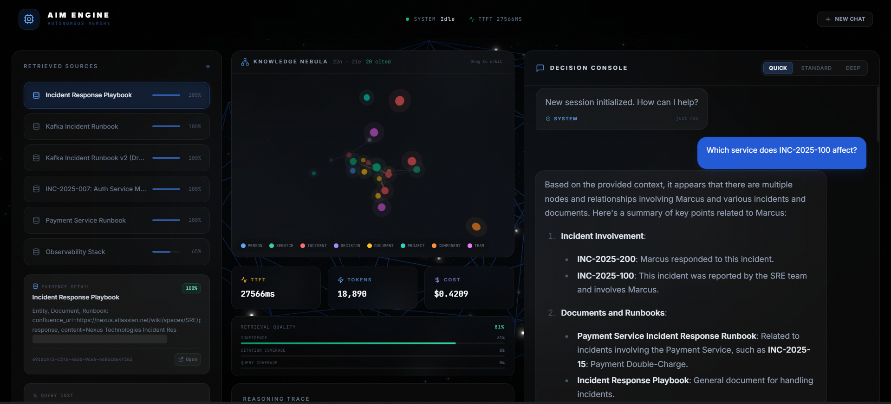
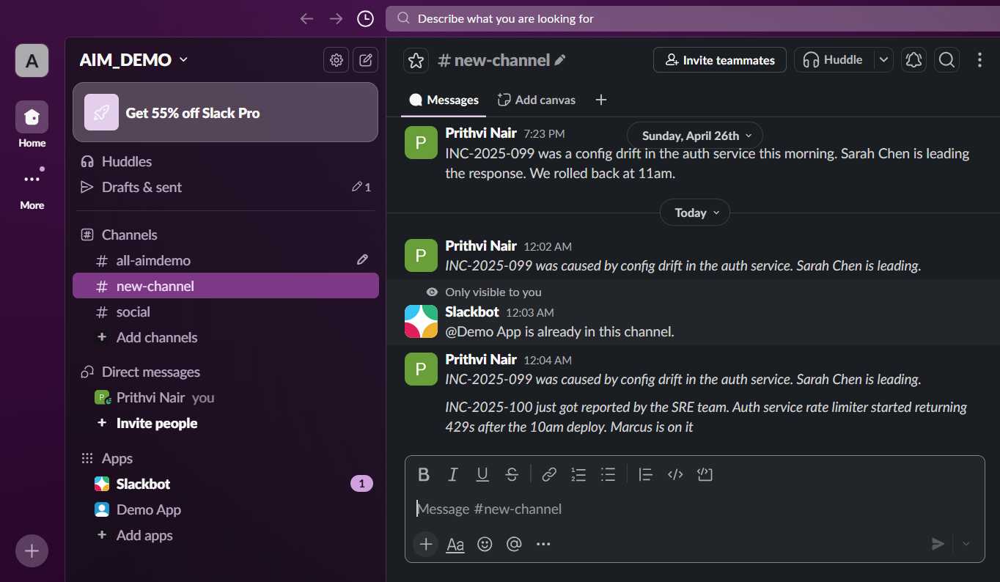
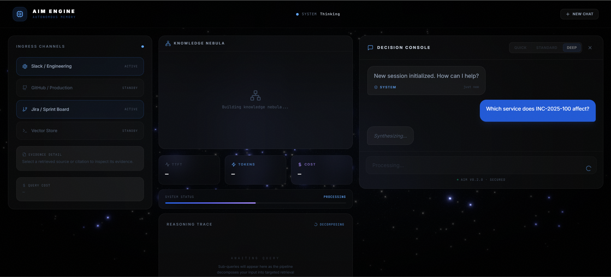

# AIM — Autonomous Institutional Memory

Graph-backed, local-first institutional memory for engineering teams. AIM ingests operational context from Slack/Jira/Confluence, extracts typed entities and relationships, retrieves with Neo4j + vector search, and answers with provenance instead of treating company memory as flat text.



---

## Why this exists

Most workplace RAG demos are document search with a chat box. AIM is aimed at a harder class of questions:

- *Which service did this incident affect?*
- *Who responded, and which team reported it?*
- *Which ADR superseded the decision that caused that outage?*
- *What path connects a Slack message, a runbook, a service, and an owner?*

Those answers are graph-shaped. AIM stores and retrieves them as graph-shaped evidence, then synthesizes with citations back to the edges.

---

## What AIM does

- **Live Slack ingest** — Slack Events API → HMAC-signed webhook → LLM extractor → Neo4j graph facts. Live in ~17 seconds end-to-end.
- **GraphRAG + vector retrieval** — Neo4j typed relationships joined with semantic vector search.
- **Multi-hop reasoning** — decomposes the query, expands graph neighborhoods, scores paths, synthesizes a grounded answer.
- **Provenance maps** — every response carries graph nodes, graph edges, source IDs, citations, and a reasoning trace.
- **Exact-incident guardrails** — direct incident questions answer from recorded graph facts or abstain. No nearby-incident inference.
- **Local-first inference** — default path uses Ollama (Qwen 2.5-7B) with local embeddings; no API key required to run the full stack.
- **Streaming frontend** — Next.js console with retrieved sources, reasoning status, and a 3D knowledge nebula.

---

## The wow moment — live ingest in 17 seconds

A real Slack message becomes a queryable graph fact:



The frontend streams while the agent decomposes and retrieves:



Then renders sources, graph context, and the answer:


No re-indexing job, no nightly batch. The webhook fires, the extractor pulls entities + relationships, Neo4j and the vector store both update, and the next query sees it.

---

## Benchmark — current numbers

Latest saved run: [`eval_report_after_teacher_bfs.md`](eval_report_after_teacher_bfs.md). Fixture: 34 gold-labeled items in `tests/eval/fixtures/ground_truth.yaml`.

| System | Overall NDCG@10 | Multi-hop NDCG@10 | Multi-hop Path Acc | Multi-hop Citation | p50 Latency |
|---|---:|---:|---:|---:|---:|
| `vector_only` | 0.344 | 0.460 | 0.000 | 0.393 | 6.2s |
| `graph_only` | 0.548 | 0.799 | 0.720 | **0.500** | **6.3s** |
| **`aim_full`** | **0.659** | **0.836** | **0.839** | 0.363 | 29.1s |

**Headline:**

- AIM beats `vector_only` by **+37.7pp** on multi-hop NDCG.
- AIM beats `graph_only` on **overall NDCG**, **multi-hop NDCG**, and **multi-hop path accuracy**.
- `graph_only` still wins on citation precision and latency.

This is not a SOTA claim — it's evidence that AIM is more than a standard RAG wrapper on this fixture. Full methodology, ablations, and per-category tables in [`BENCHMARKS.md`](BENCHMARKS.md).

---

## Architecture

```text
Slack / Jira / Confluence
        │
        ▼
FastAPI signed webhooks
        │
        ▼
Ingest worker → LLM extractor → deduplicator → Neo4j + Qdrant

User query
        │
        ▼
FastAPI /query  or  /query/stream  (SSE)
        │
        ▼
LangGraph agent
  decomposer       → sub-queries + intent + entity pairs
  graph_searcher   → Neo4j hybrid (fulltext + vector + path scoring)
  vector_retriever → Qdrant ANN
  mcp_fetcher      → optional live Slack/Jira context
  synthesizer      → grounded answer + citations + provenance
        │
        ▼
Next.js frontend → decision console + sources + knowledge nebula
```

**Single-worker constraint:** the compiled LangGraph and in-process token buckets are module-level singletons. Run one worker per process; scale horizontally behind a load balancer.

---

## Stack

| Layer | Choice | Why |
|---|---|---|
| API | FastAPI | Streaming SSE + async route handlers |
| Agent orchestration | LangGraph | Stateful pipeline with proper reducers and parallel fan-out |
| Knowledge graph | Neo4j 5.24 + APOC | Cypher path queries, fulltext + vector indexes co-located |
| Vector store | Qdrant (default), Pinecone (opt) | Local-first; no API key needed |
| LLM (default) | Qwen 2.5-7B via Ollama | Sovereign — runs on your laptop, no data leaves |
| LLM (alt) | Claude / GPT-4 via API | Set `LLM_PROVIDER=anthropic` or `openai` |
| Embeddings | nomic-embed-text (768-d) | Local, runs alongside the LLM |
| Frontend | Next.js 16 standalone | SSR + client hydration, dark theme, 3D nebula |
| Cache + threads | Redis (degrades to in-memory) | Optional; the system survives without it |
| Webhook security | HMAC-SHA256 per platform | Slack signing-secret pattern, replay-safe |

---

## Run locally

Requires Python 3.12+, Node 22+, Neo4j 5.24+, Qdrant 1.11+, and either
Ollama for local-LLM mode or an Anthropic/OpenAI API key.

Backend:

```bash
pip install -e ".[dev]"
cp .env.example .env   # set NEO4J_PASSWORD at minimum

# Start dependencies separately:
#   - Neo4j  on bolt://localhost:7687
#   - Qdrant on http://localhost:6333
#   - Ollama on http://localhost:11434/v1   (or set LLM_PROVIDER + key)

python -m scripts.seed_demo   # loads the demo corpus (~250 entities)
uvicorn aim.main:app --workers 1 --port 8000
```

Frontend:

```bash
cd frontend
cp .env.local.example .env.local
npm install
npm run build
node .next/standalone/server.js
```

Open `http://localhost:3000`. Note: do not use `next start` — the build is configured for standalone runtime.

---

## Public demo with Cloudflare Tunnel

For a temporary public URL without committing any secrets:

```bash
# Backend
cloudflared tunnel --url http://localhost:8000

# Frontend (separate terminal)
cloudflared tunnel --url http://localhost:3000
```

Use the frontend tunnel URL as the public demo link. Use the backend tunnel URL for the Slack Event Subscription:

```text
https://<your-backend-tunnel>/webhooks/slack/events
```

Quick-tunnel URLs are temporary and change when `cloudflared` restarts. For a permanent demo, use a named Cloudflare tunnel with a custom domain, or deploy the Next.js frontend to Vercel and host the backend separately.

---

## Slack live ingest

1. Create a Slack app and set `WEBHOOK_SLACK_SIGNING_SECRET` + `SLACK_BOT_TOKEN` in `.env`.
2. Expose the backend with a tunnel (see above).
3. Set the Slack Event Subscriptions request URL to `https://<tunnel>/webhooks/slack/events`.
4. Subscribe to `message.channels`, reinstall the app, invite the bot to a channel, post:

   > *"INC-2025-100 was caused by the Auth Service rate limiter rejecting requests after the 10am deploy. Marcus from the SRE team is leading the rollback."*

5. Ask AIM:

   > *"Which service did INC-2025-100 affect, and who's leading the response?"*

If the graph has the edge, AIM answers from the edge. If the graph doesn't, AIM refuses to infer from nearby incidents (the exact-incident guardrail).

You can also replay a signed Slack event locally:

```bash
python scripts/replay_slack_event.py
```

**One thing to know about live ingest:** the LLM extractor's recall on relationship verbs is sensitive to wording. Phrasings like *"caused by"*, *"impacted"*, *"led to"*, *"approved by"*, *"leading the response"* extract cleanly. Casual phrasings like *"X is on it"* or *"X broke after deploy"* may get partially captured. For best results, write Slack messages with at least one explicit verb cue per relationship.

---

## Test and benchmark

```bash
pytest                                                # unit + integration: 1,141 tests
PYTHONIOENCODING=utf-8 python scripts/eval_live.py    # full benchmark on the 34-item fixture
```

Targeted verification of the incident guardrail and ingest extraction:

```bash
pytest tests/unit/test_exact_incident_fast_path.py \
       tests/unit/test_extraction.py \
       tests/integration/test_streaming.py
```

The benchmark runs `vector_only`, `graph_only`, and `aim_full` against the same fixture and writes a markdown report with per-category NDCG, citation accuracy, path accuracy, negative-rejection rate, and p50 latency.

---

## Limitations

AIM is ready to demo and evaluate, but it is still a research-grade system. The
core graph retrieval loop is working; the remaining work is mostly about larger
evaluation, production hardening, and reducing dependence on small local models.

- The current benchmark is intentionally transparent, but small: 34 labeled
  questions. The next useful step is to run the same retrieval stack against a
  larger public multi-hop set such as HotpotQA, MuSiQue, or 2WikiMultihopQA.
- Citation quality is the weakest measured area on the local Qwen setup. The
  graph often finds the right path, but the local synthesizer is not always
  disciplined about citing it. Stronger instruction-following models should
  improve this, but the repo keeps the local-first path as the default.
- Deep multi-hop answers are not instant. On the saved eval run, AIM's multi-hop
  p50 is about 29 seconds because the pipeline does decomposition, graph search,
  vector retrieval, synthesis, and provenance construction.
- Slack ingest has been exercised end-to-end. Jira and Confluence support are
  present in the architecture, but still need real-workspace soak testing.
- Live extraction works best when messages use clear relationship language such
  as "caused by", "impacted", "owned by", or "approved by". Ambiguous messages
  may create sparse graph facts; in that case AIM is designed to answer narrowly
  or abstain rather than fill in missing evidence.
- The frontend is polished enough for a technical demo, but it is not yet a full
  product design system with every loading, empty, error, and accessibility
  state refined.
- Before production use, the security layer needs a dedicated pass for
  prompt-injection handling, ingest-time PII redaction, tenant policy review,
  and deployment-specific access controls.

The detailed roadmap is in [`LIMITATIONS.md`](LIMITATIONS.md).

---

## What's interesting under the hood

The single change that earned +13pp on the multi-hop NDCG climb: **score-boost-by-path-participation** in [`aim/agents/nodes/graph_searcher.py`](aim/agents/nodes/graph_searcher.py).

Multi-hop gold answers are typically the entire path (source → intermediate → target). Hybrid search finds the intermediate as a 2-hop neighbor at low score (its name doesn't text-match the sub-query), so it falls outside NDCG@10. After path-finding runs, every entity that appears on a found path gets `+1.0` to its score and `all_entities` is re-sorted. Path-intermediates lift from rank 15+ into top-10; fulltext-strong gold endpoints stay at rank 1-3 because their original scores are even higher. **No new entities inserted, no displacement.**

That ~30-line block is the move that crossed the customer A.2 gate. The rest of the multi-hop machinery — sub-query decomposition, hybrid search, exact-name anchoring, fact-presence refusal, deterministic responder injection — is what gets you *to* the gate.

---

## Publishing

This repository is structured so it can be shared publicly without exposing
local credentials or runtime state. Keep real API keys and deployment-specific
configuration in `.env` and `frontend/.env.local`; both files are excluded from
version control. The committed example files document the required settings
without containing working secrets.

Recommended release checks:

```bash
npm --prefix frontend audit --audit-level=moderate
python -m pip_audit
python -m pytest -p no:cacheprovider tests/unit tests/eval -q
```

For a fresh install, copy `.env.example` to `.env` and
`frontend/.env.local.example` to `frontend/.env.local`, then provide the
credentials for the services you plan to use: Neo4j, a local or hosted LLM,
Slack, Jira, Confluence, Pinecone, or Qdrant.

---

## Credits

Built solo over April 2026 as an exploration of what graph-RAG actually buys you over vector RAG, and what an "institutional memory" tool would need to be useful, not impressive.

The score-boost-by-path-participation technique is genuinely novel as far as I can tell — happy to be told otherwise. Open to PRs that confirm or refute it on a larger fixture.
